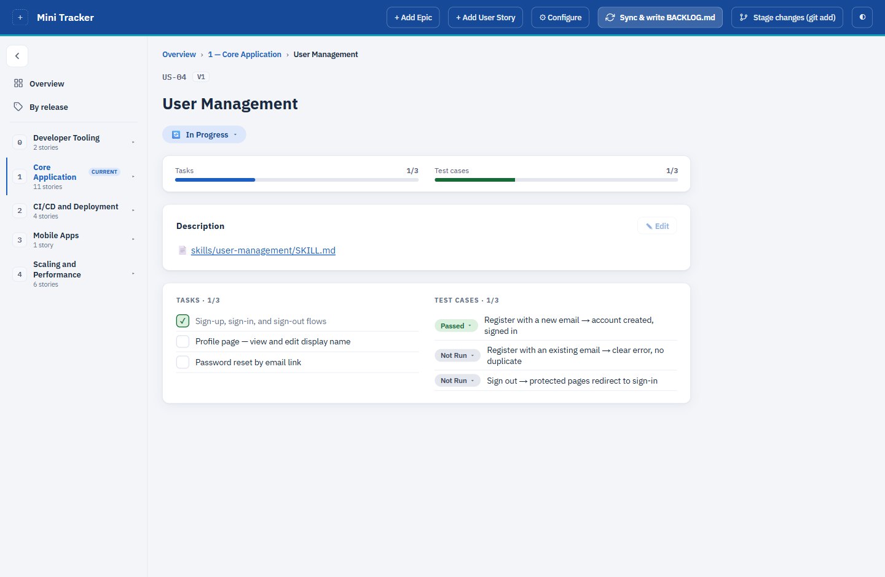

# Mini Tracker

A minimal Jira/Azure-DevOps-style backlog and skills tracker, built around UI/UX simplicity.

It's a small web board over one `BACKLOG.md` file. Click a status, and it's saved to the file
straight away — no save button, no database, no account.




## Setup

**You need one thing:**  [Download .NET 9 or higher](https://dotnet.microsoft.com/download).

Check if you have it in terminal or powershell:

```bash
dotnet --version
```

If that prints `9.` or higher, you're ready. Then:

```bash
git clone https://github.com/georgetour/Mini-Tracker.git
cd Mini-Tracker
dotnet run --project src/MiniTracker.Api
```

Open **http://localhost:5249** in your browser. It's the same address every time.

That's the whole setup. There's nothing to install, configure, or sign up for — the first run works
immediately with demo content so you can see what it does before pointing it at anything of yours.

**To stop it:** press `Ctrl+C` in the terminal.

You'll see a demo project with 5 epics and 24 stories. Click around — it's a real, editable copy, so
nothing is at stake.

### Where your changes are saved

**Everything is written to one markdown file.** There is no database and no hidden storage.

Until you point Mini Tracker at your own project, that file is the bundled demo:

```
src/MiniTracker.Api/data/BACKLOG.demo.md
```

So when you add an epic, change a status, or tick a task, that file changes on disk immediately —
open it in your editor and you'll see it. Skill files live beside it in
`src/MiniTracker.Api/data/skills/`.

Both are ignored by git, so the demo you scribble on never ends up in a commit. Once you point
Configure at your own `BACKLOG.md`, everything is written there instead — and that file is yours to
commit.

## Use it with your own project

1. Go to **http://localhost:5249/configure** (or click **⚙ Configure** in the top bar).
2. In **Backlog file**, type where your `BACKLOG.md` is — for example `C:/projects/my-app/BACKLOG.md`.
   *If the file doesn't exist yet, Mini Tracker creates it for you.*
3. In **Skills folder**, type the folder your `skills/...` paths start from — for example
   `C:/projects/my-app`. Leave it empty if you don't use skill files.
4. Click **Save changes**. Your board loads.

Your settings are remembered in `tracker.config.json` next to the app. It's never committed to git.

## The screen, explained

The window has three parts: a **top bar** across the top, a **sidebar** down the left, and the
**main area** filling the rest.

### Top bar — actions

- **Logo** (far left) — while it's an empty `+` box, clicking it takes you to Configure so you can
  upload one. Once a logo is set, clicking it goes back to the Overview, like any website logo.
- **＋ Add Epic** — goes to `/add-epic`. Type a title, that's all. The epic number is assigned for
  you, the same way a database assigns an ID.
- **＋ Add User Story** — goes to `/add-story`. Pick which epic it belongs to and type a title. The
  `US-` code is assigned for you.
- **⚙ Configure** — goes to `/configure`. Choose which `BACKLOG.md` to use, which skills folder, and
  your logo.
- **Reload from file** — re-reads `BACKLOG.md` from disk. Use it after editing the file by hand or
  pulling from git. It does **not** save anything; your clicks were already saved.
- **Stage in git** — runs `git add BACKLOG.md` so the change is ready for your next commit. It never
  commits and never pushes.
- **◐** — switches between light and dark.
- **☰** — appears only on narrow windows. Slides the sidebar in; click outside or press `Esc` to
  close it.

### Sidebar — finding things

- **Overview** — every epic with its stories. This is the home screen.
- **By release** — the same stories grouped by version (V1, V2 …) instead of by epic. Useful for
  "what's left before we ship?"
- **An epic name** — opens that epic on its own, where every story is shown expanded with its tasks
  and test cases.
- **▾ / ▸** next to an epic — shows or hides that epic's stories in the sidebar.
- **A story name** — jumps straight to that story.
- **‹ / ›** at the top — collapses the sidebar to narrow icons and back, for more reading room.

### Main area — doing the work

- **A story title** — opens that story: its description, tasks, test cases and progress bars.
- **A status chip** (`In Progress`, `Done` …) — click it, pick a new status from the list. Written to
  `BACKLOG.md` immediately.
- **A task checkbox** — ticks a task off. Written immediately.
- **A test-case chip** (`Not Run` / `Passed` / `Failed`) — the same, for that test case.
- **✎ Edit** on a story's Description — opens that story's `SKILL.md` in a text editor. **Save**
  writes the file, **Cancel** throws the changes away.

**Nothing here has a save button, on purpose** — every click is written to the file as you make it.
The one exception is the `SKILL.md` editor, where you're writing prose and should decide yourself
when it's finished.

## Writing your BACKLOG.md

The quickest start is to copy `templates/BACKLOG.template.md`. If you'd rather write your own, this is
the whole format:

```markdown
# Epic 0: Your Epic Title

## US-01 · Your Story Title

> **Status**: 🔄 In Progress · **Skill**: `skills/your-area/SKILL.md` · **Release**: V1

### Tasks

| # | Task | ✓ |
|---|------|---|
| 1.0 | Something to do | ⬜ |

### Test Cases

| ID | Description | Status | Notes |
|----|-------------|--------|-------|
| TC-01-01 | Something to check | ⬜ Not Run | |
```

**Statuses:** ⬜ Not Yet Started · 🔍 Under Review · ✨ Refined · 🔄 In Progress · 🧪 Vendor Test ·
✅ Done · ⏸ On Hold

**Tasks:** ⬜ or ✅ **Test cases:** ⬜ Not Run · ✅ Passed · ❌ Failed

`**Skill**:` is optional — use it on stories that have a written spec.

## Why it's built this way

- **No database.** Your `BACKLOG.md` is the data. It's already in git, with full history.
- **No cost.** No licences, no seats, no hosting.
- **No setup.** One command. No Node, no npm, no build step.
- **Readable diffs.** A click changes exactly one value in the file and leaves everything else alone.
- **Still just markdown.** Edit it by hand, review it in a pull request, grep it.

> Mini Tracker runs on localhost and has no login. Don't expose it on a public network.

## How it works

```
Browser                          C# (ASP.NET Core)
─────────────────────────        ─────────────────────────
index.html, app.css, app.js  ◄── served as static files
      │
      ├─ GET  /api/board     ──►  read + parse BACKLOG.md
      └─ POST /api/story/…   ──►  change one status in the file
```

C# handles the file: reading it, changing one value at a time, and updating the summary counts.
The browser handles the screen, using [Alpine.js](https://alpinejs.dev) — 60 KB, shipped with the
app, no CDN, no npm, no build step. Every screen is written as ordinary HTML in `index.html`;
Alpine fills it in from the JSON the API returns.

It uses Alpine's CSP build, so the app can send a strict `Content-Security-Policy`: no inline
scripts, no `eval`, nothing loaded from another site. Text from your files is written to the page as
text, never as markup, so a backlog can't inject anything into the page.

```
src/MiniTracker.Api/
├── Backlog/    read, write and summarise BACKLOG.md
├── Services/   settings and file lookup
└── wwwroot/    the screen — index.html, app.css, app.js, vendor/alpine-csp.min.js
templates/      starter BACKLOG.md and SKILL.md files
tests/          test suite
```

## Run the tests

```bash
dotnet test
```

## Fixing the summary counts by hand

Your `BACKLOG.md` has a generated block between `<!-- STATUS-SUMMARY:START -->` and `:END -->` that
counts stories by status, version and epic. Mini Tracker updates it whenever you click something.

If you edit the file by hand, those counts go out of date. This command recalculates them:

```bash
dotnet run --project src/MiniTracker.Api -- sync-status
```
