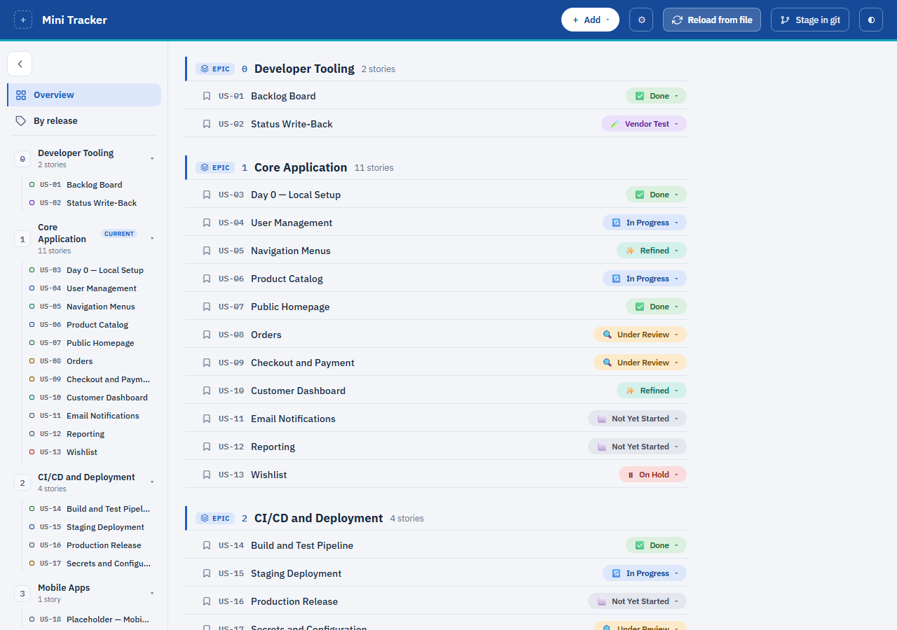
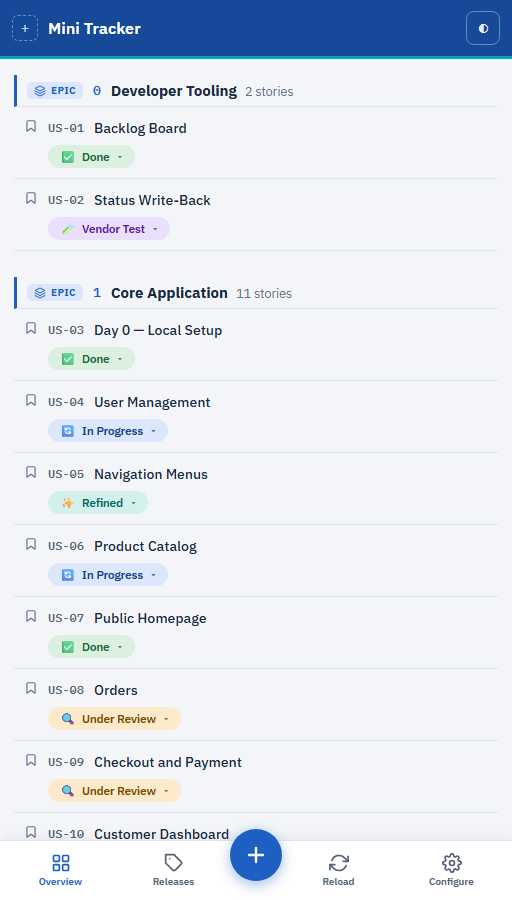

# Mini Tracker

A minimal Jira/Azure-DevOps-style backlog tracker, built around UI/UX simplicity.

It's a small web board over plain files in your project. Click a status and it's saved straight
away — no save button, no database, no account.



Responsive down to 320px — the same board on a phone, with the destinations moved to a bottom bar:



## Setup

**You need one thing to install:** [.NET 9 or higher](https://dotnet.microsoft.com/download).

Check what you have:

```bash
dotnet --version
```

If that prints `9.` or higher, you're ready:

```bash
git clone https://github.com/georgetour/Mini-Tracker.git
cd Mini-Tracker
dotnet run --project src/MiniTracker.Api
```

Open **http://localhost:5249**. It's the same address every time. To stop it, press `Ctrl+C` in the
terminal.

That's the whole setup. Nothing to install, configure or sign up for — the first run shows a demo
project with 5 epics and 24 stories so you can click around before pointing it at anything of yours.
The demo is a real, editable copy, and it's gitignored, so nothing you do to it is at stake.

## Where everything is stored

There are only three kinds of file. No database, no hidden state.

```
BACKLOG.yaml                     the index — every epic and story, and its status
skills/
  README.md                      explains the layout to anyone (or anything) reading the folder
  checkout-and-payment/          one folder per story, named after the story
    SKILL.md                     what the story IS — description, acceptance criteria
    tasks.yaml                   what has to be BUILT, and whether it's done
    test-cases.yaml              what has to be VERIFIED, and whether it passed
```

**`BACKLOG.yaml` is an index, deliberately.** It holds epics, stories, their status and which folder
each story owns — and nothing else. That's what lets the board open instantly no matter how much
detail your stories carry: drawing the board never opens a single story folder.

**Each story owns a folder.** Everything about that one story lives in it. Point a coding agent at
`skills/checkout-and-payment/` and it has the whole picture — the prose, the work, the checks —
without reading anything else.

**Why two files for tasks and test cases?** They're different questions. Tasks answer *is it built*;
test cases answer *does it work*. They're written at different times by different people, so ticking
a task never rewrites your test results.

## What each action writes

Every button maps to exactly one file. Nothing writes to two places at once.

| What you do | What changes on disk |
|---|---|
| Add an epic | `BACKLOG.yaml` — a new epic, numbered for you |
| Add a story | `BACKLOG.yaml` — a new story, plus a new `skills/<story>/` folder with a starter `SKILL.md` |
| Rename an epic | `BACKLOG.yaml` — the title only; its stories are untouched |
| Change a story's status | `BACKLOG.yaml` — one line |
| Add / edit / delete / tick a task | `skills/<story>/tasks.yaml` |
| Add / delete a test case, or change its result | `skills/<story>/test-cases.yaml` |
| Edit a description | `skills/<story>/SKILL.md` |
| Delete a story | `BACKLOG.yaml` — the entry — and then its whole folder |
| Delete an epic | `BACKLOG.yaml` — the epic — and the folders of every story in it |
| Upload a logo, change paths | `tracker.config.json` (settings only — never your backlog) |
| **Reload from file** | **nothing** — it re-reads and checks your files |
| **Stage in git** | **nothing** — it runs `git add` on your backlog |

Notice what's *not* there: changing a status never touches a story's tasks, and ticking a task never
touches the backlog. That's why two people editing different things don't collide.

**Until you point it at your own project**, all of that happens inside
`src/MiniTracker.Api/data/`, which is gitignored. Your scribbling on the demo can't end up in a commit.

## Use it with your own project

1. Go to **http://localhost:5249/configure** (or click **⚙** in the top bar).
2. In **Backlog file**, type where your `BACKLOG.yaml` is — for example
   `C:/projects/my-app/BACKLOG.yaml`. *If it doesn't exist yet, Mini Tracker creates it for you.*
3. In **Skills folder**, type the folder that holds your story folders — for example
   `C:/projects/my-app/skills`.
4. Click **Save changes**. Your board loads.

Your settings live in `tracker.config.json` next to the app, and are never committed.

**Already have a `BACKLOG.md`?** Earlier versions kept everything in one markdown file. Convert it:

```bash
dotnet run --project src/MiniTracker.Api -- migrate path/to/BACKLOG.md
```

That writes `BACKLOG.yaml` beside it and one folder per story. It never overwrites an existing
`BACKLOG.yaml` or a `SKILL.md` you already wrote, and your `BACKLOG.md` is left exactly as it was.

## Writing the files by hand

They're plain text and they're yours. The quickest start is to copy `templates/BACKLOG.template.yaml`
and `templates/skills/`, but this is the whole format.

**`BACKLOG.yaml`**

```yaml
project: My Project
roadmap: [V0.1, V1]

epics:
  - number: 0
    title: Your Epic Title
    stories:
      - code: US-01
        title: Your Story Title
        status: In Progress
        release: V1
        folder: your-story-title
```

**`skills/your-story-title/tasks.yaml`**

```yaml
- text: Something to build
  done: false
```

**`skills/your-story-title/test-cases.yaml`**

```yaml
- text: Something to check
  status: Not Run
```

**`skills/your-story-title/SKILL.md`** is ordinary markdown — whatever you want the story to say.

**Statuses:** Not Yet Started · Under Review · Refined · In Progress · Vendor Test · Done · On Hold

**Test-case results:** Not Run · Passed · Failed

Write them as plain words. The emoji you see on screen are added by the app, not stored in the file.

If you get the YAML wrong, **Reload from file** tells you the file and the line, rather than showing
you an empty board.

## Why it's built this way

- **No database.** Your files are the data. They're already in git, with full history.
- **No cost.** No licences, no seats, no hosting.
- **No setup.** One command. No Node, no npm, no build step.
- **Readable diffs.** A click changes one value and leaves the rest of the file alone.
- **Still just files.** Edit them by hand, review them in a pull request, grep them.

> Mini Tracker runs on localhost and has no login. Don't expose it on a public network.

## How it works

```
Browser                                C# (ASP.NET Core)
────────────────────────────           ──────────────────────────────────────────
index.html, app.css, app.js  ◄──       served as static files
      │
      ├─ GET  /api/board          ──►  BACKLOG.yaml — epics and stories only
      ├─ GET  /api/story/US-01    ──►  that story folder's tasks and test cases
      ├─ POST /api/story/…/status ──►  one line in BACKLOG.yaml
      ├─ PUT  /api/story/…/tasks  ──►  that story's tasks.yaml
      └─ GET  /api/validate       ──►  check every file, report line numbers
```

The board reads only the index, so it stays fast however much detail your stories carry. A story's
tasks and test cases are fetched when you open it, and not before.

Writes are whole-file: read, change, write back. One writer, so nothing more elaborate is needed,
and the output is stable enough that one status change is one line in `git diff`.

```
src/MiniTracker.Api/
├── Backlog/         reading and writing BACKLOG.yaml and the story folders
│   └── Legacy/      importing an old BACKLOG.md — nothing else uses it
├── Services/        settings, path resolution
└── wwwroot/         the screen — index.html, app.css, app.js, vendor/alpine-csp.min.js
templates/           a starter BACKLOG.yaml and skills/ folder
tests/               test suite
```

## Technologies

| | | |
|---|---|---|
| **.NET 9** | ASP.NET Core Minimal API | the only thing you install |
| **YamlDotNet** 18.1 | reads and writes the files | one NuGet package |
| **Alpine.js** (CSP build) | 60 KB, vendored | no CDN, works offline |
| `app.js` | 43 KB | state, routing, API calls |
| `app.css` | 36 KB | one stylesheet |
| `index.html` | 38 KB | every screen, as plain HTML |
| C# | 1,776 lines | across the whole backend |
| Tests | 183 | `dotnet test` |

No Node, no npm, no bundler, no build step. Two dependencies in total.

If you landed here looking for either of those in practice, this is a working reference for both:
**YamlDotNet** round-tripping a real file deterministically enough that one edit is one line of
`git diff`, and **Alpine's CSP build** driving a whole app under a strict `Content-Security-Policy`
with no `eval` and no inline scripts. Both are lightly documented elsewhere.

Alpine's CSP build lets the app send a strict `Content-Security-Policy` — no inline scripts, no
`eval`, nothing loaded from another site. Text from your files reaches the page as text, never as
markup.

**Responsive down to 320px.** Below 900px the sidebar becomes a drawer; below 768px it's gone and a
bottom bar carries the destinations with the add action raised in the centre. Nothing scrolls
sideways at any width. Add it to your phone's home screen and it behaves like an app.

## Performance

Measured against a synthetic backlog of **1,000 stories across 50 epics** — 3,000 story files —
driven for 5 minutes with a realistic mix of reading, ticking and writing. 7,225 operations, zero
errors. Milliseconds:

| Action | p50 | p95 | p99 |
|---|---|---|---|
| Open a story | 19 | 32 | 45 |
| Load the board | 20 | 31 | 52 |
| Tick a task | 39 | 55 | 77 |
| Add a task | 39 | 56 | 88 |
| Set a test result | 39 | 53 | 81 |
| Change a status | 46 | 87 | 111 |
| Check every file (Sync) | 236 | 267 | 498 |

Opening a story costs the same at 1,000 stories as at 20, because it reads one folder rather than
the backlog. Keeping tasks and test cases in the index instead measured **270 ms per board load
against 20 ms** — which is why they aren't in it.

Reproduce it yourself:

```bash
node tests/perf/generate.js /tmp/perf 50 20     # 50 epics × 20 stories
dotnet run -c Release --project src/MiniTracker.Api -- --BacklogPath=/tmp/perf/BACKLOG.yaml
node tests/perf/drive.js http://localhost:5249 300
```

## Run the tests

```bash
dotnet test
```

## Roadmap

**Next release — v1.0**, after testing and confirmation.

- Dockerfile, so it runs anywhere without installing .NET
- A devcontainer, so it opens straight in GitHub Codespaces

**Later, if people find it useful.**

- User management, for teams sharing one backlog
- A self-hosted mode with authentication

Both of those are real work rather than a promise: multiple users means solving concurrent writes
first, and an account system means holding credentials that a local tool never has to. They're worth
doing if there's demand, and not worth doing on a guess.

---

MIT licensed — see [LICENSE](LICENSE). Mini Tracker is an independent project with no connection to
Atlassian or Microsoft; Jira and Azure DevOps are their trademarks.
